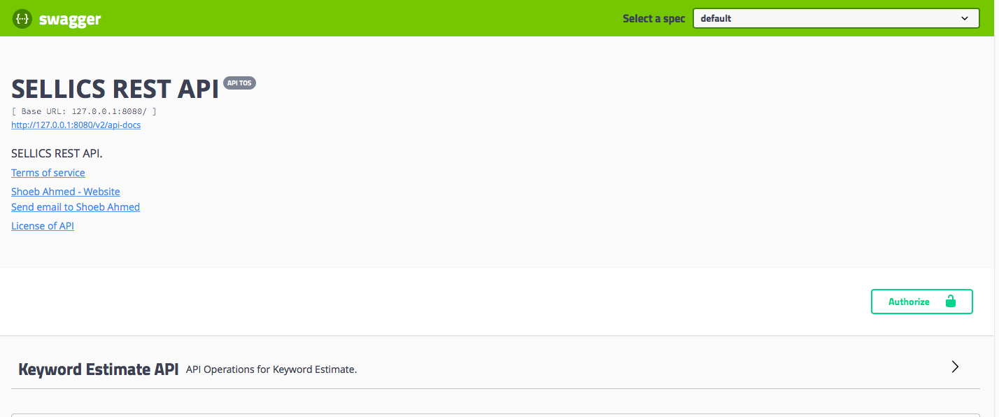
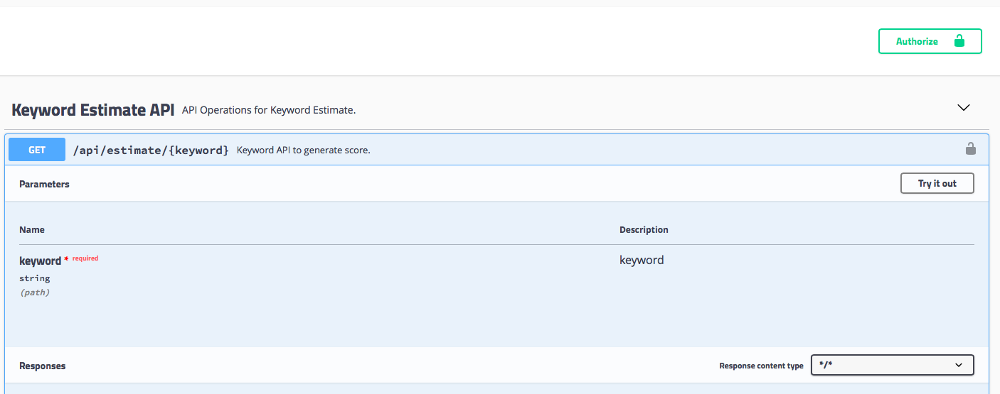
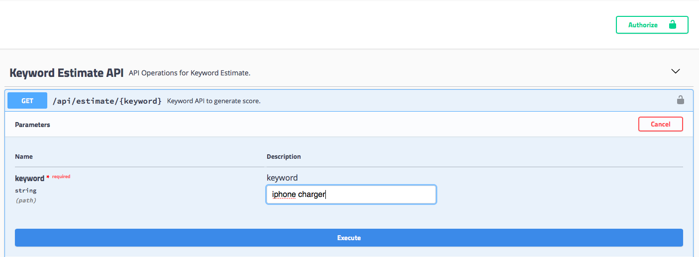
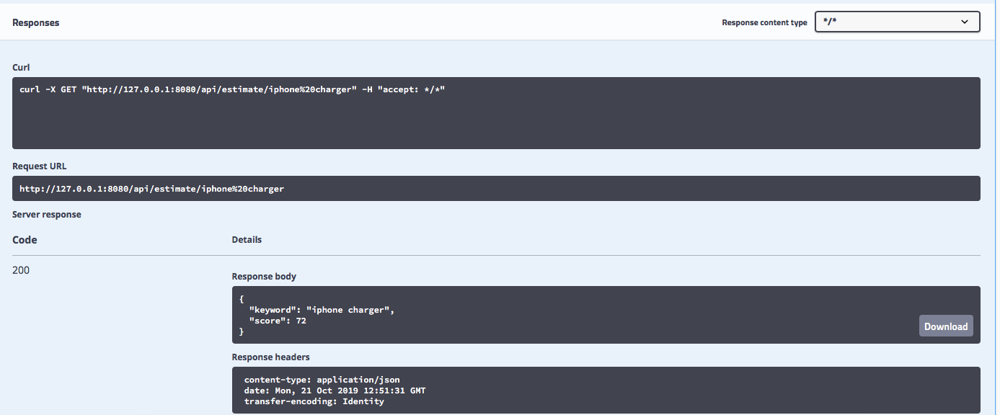

# Sellics AWS Completion API

This assignment is prepared for Sellics. API to generate a score for keyword passed in the search endpoint. For this assignment I have considered maximum of two keyword. This API will generate score between 0 to 100. This solution can be enhanced to support more than two words for keyword matching. API will work, but will give score more than 100 :smirk:

### Contents
  1. [Design Consideration](#design-consideration)
  2. [Assumption](#assumption)
  3. [Ecosystem and Library](#ecosystem-and-library) 
  4. [How to build and run Sellics μS](#ecosystem-and-library)
 

### [Design Consideration](#design-consideration)
  I have used Spring Boot Microservice's to build keyword estimate API. Swagger is incorporated to quickly verify this application.  Java Google Coding standards is used to format code while developing.

  ##### Amazon Autocomplete API
    As specified in assignment I have used Amazon Autocomplete API to generate scroe. As we know Amazon
    returns only top 10 results for the keyword being search. Which means, the keyword which is returned
    has 10 matching keyword, has atleast 10 rank in AWS Keyword database. 
    
    As a next step, I have prepared permutation or keyword's for example if you are searching for 
    "iphone charger" following are the 4 sets of possible combination
       * iphone
       * charger
       * iphone+charger
       * charger+iphone
    
    So 4 parallel calls are make to AWS Completion API and in response keyswords I check whether 
    iphone or charger is present. If present I increse the score by 1. 
    
    Two return a healthy score, I have considered two keywords and added a offset score of 50. 
    This offset can be removed. Please check the response for "iphone charger" score of 72 is 
    returned. 
 

### [Assumption](#assumption)
    I have assumed to use basic Spring Boot to build this assignment. Due to time consideration, 
    I was unable to write comments in Java file, but named variable and function to conveys 
    its purpose. If response from AWS is not available or takes time, 0 score is returned after 
    10 seconds. 

### [Ecosystem and Library](#ecosystem-and-library)
  Java 8
  Eclipse IDE on Mac.
  Maven to build this Sellics μS.
  Docker to package and run this Sellics μS.
  Swagger to document and run API.
  Lombok to reduce boiler code for getter, setter and constructor.

### [How to build and run Sellics μS](#ecosystem-and-library)
  
  Once code is cloned on your local system, open terminal(command) window and go to sellics-keyword
  folder.
    
  
  Build project with Maven, this command will also run integration test which need mongo database.
    
    mvn clean install
  
  Once the product build result in success
  
  After this run μS with docker compose command.
  
    docker-compose up -d
  
  μS runs on port 8080 and accessible from this URL. In case you are unable to access with IP you can 
  try with localhost. μS will load staging data for three products, to test API's. Please follow below 
  steps docuemented to use this API.
  
    http://127.0.0.1:8080/swagger-ui.html
   
 Finally to shutdown this μS you can run following command.	
	
    docker-compose down
    
Step 1 : On Swagger Page, you can click on Keyword Estimate API. 

Step 2 : Click on Try it Out button.

Step 3 : Enter keyword you want to search the scroe for and click on Execute button

Step 4 : From Response you can see score is returned.

